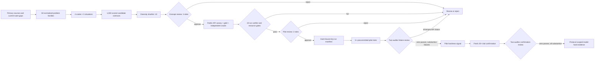

# ORBIT-Q problem-discovery research loop

This package contains the first source-grounded design matrix and a gated,
resumable workflow for future TensorCircuit benchmark problems. It expands 50
scientific families across four resource scales and five operational
situations, producing 1,000 deterministic candidate contracts. These are 1,000
auditable regimes, not 1,000 independently sourced problem statements. The
pipeline then selects ten candidates for human design review.

The shortlist is **not** a claim that GPT-5.6-sol cannot solve these problems.
The frozen design rows retain `empirical_status=untested` as an
**at-discovery-time** field. Current expert and model runs live separately in
`empirical_evidence.json` and `empirical_evidence.md`, so new evidence does not
silently rewrite the 1,000-contract source snapshot. A model-hardness claim is
allowed only after expert feasibility, human approval, repeated frozen-model
trials, and human failure classification.

## What was sampled

The research pass used five complementary search strategies:

1. landscape mapping across algorithms, control, metrology, QEC, simulation,
   open systems, measurement, chemistry, dynamics, and verification;
2. cross-vocabulary search for the same computational obstruction under
   different subfield names;
3. cross-method search around TensorCircuit representations, AD, channels,
   dynamic circuits, and tensor-network contraction;
4. negative-result search for infeasible scaling, barren plateaus,
   ill-conditioning, and weak statistical certificates;
5. benchmark/dataset search for task structures and documented agent gaps.

Each candidate is scored from eight perspectives: expected agent difficulty,
TensorCircuit path confidence, scientific value, verifier feasibility, runtime
fit, determinism, novelty, and shortcut resistance. These are transparent
design priors recorded in `candidates.jsonl`; they are never mixed with model
trial results.

`research_protocol.json` defines the repeatable next-cycle stages: query
planning, immutable raw-result ingest, claim-level normalization, exact and
semantic deduplication, coverage sampling, scoring, and human source review.
The current snapshot used agent-assisted primary-source research; this package
does not silently perform network searches. A search adapter must preserve its
query log and raw response hashes under `.artifacts/problem-discovery/` before
new source records can be curated into `catalog.json`.

## Human-gated workflow



The CLI requires distinct declared identities for the gate roles:

- `quantum_scientist`: physical meaning, conventions, and scientific value;
- `tensorcircuit_expert`: public pinned API and framework-native centrality;
- `verifier_engineer`: independent oracle, hidden tests, tolerances, and anti-cheat;
- `benchmark_owner`: protocol, resource envelope, and contamination controls;
- `independent_reviewer`: blind review of the frozen pilot package.

Prototype admission requires all of the following:

- public-API canary passes in the pinned image;
- expert baseline and independent oracle are separately hashed;
- verifier, prompt, image digest, and source commit are frozen;
- expert p95 runtime is at most 180 seconds;
- independent oracle runtime is at most 240 seconds;
- gold solution is at most 160 effective Python lines;
- verifier-only succeeds in at least 20 reproductions;
- at least 25 distinct seeds pass finished expert-only Harbor verifier runs;
- every expert run freezes the task, prompt, image, CPU/memory, and oracle mode;
- the evaluator emits a hash-bound admission record under one fixed threshold policy;
- measured peak memory fits the observed runner envelope.

Infrastructure, authentication, policy refusal, ambiguous specification, and
framework impossibility are excluded from model-hardness evidence. Runtime
alone is not a failure under the ORBIT-Q reward definition, although a missing
or excessive runtime blocks candidate admission here.

## Commands

Rebuild the deterministic corpus and report from the normalized catalog:

```bash
python3 scripts/run_problem_discovery.py build
python3 scripts/run_problem_discovery.py status
```

Run the resumable offline source-discovery stages with a reviewed query plan and
operator-provided raw-hit manifests:

```bash
python3 scripts/run_autoresearch_discovery.py plan \
  --plan .artifacts/problem-discovery/query-plan.json
python3 scripts/run_autoresearch_discovery.py run \
  --plan .artifacts/problem-discovery/query-plan.json \
  --raw-manifest .artifacts/problem-discovery/provider-results.json
```

This command performs deterministic ingest, normalization, exact/near
deduplication, and coverage sampling. It deliberately performs no network
search and never treats an operator-provided result as independently attested.
See `AUTORESEARCH_DISCOVERY.md` for the schemas, custody boundary, and
stage-by-stage resume commands.

Verify the sanitized empirical snapshot from its committed, file-by-file source
manifest. This mode works in a clean clone and does not need private job logs:

```bash
python3 scripts/build_problem_discovery_evidence.py --check
```

Operators with the ignored raw jobs can separately reconstruct and compare the
snapshot, including task files, rollouts, configs, and oracle transcripts:

```bash
python3 scripts/build_problem_discovery_evidence.py --check-raw
```

That ledger labels passing target-model pilots as hardness-blocking and keeps a
single substantive failure at the weaker `pilot_hardness_signal` level. It
does not convert exploratory runs into protocol-qualified hardness evidence.

Record concept approval one role at a time:

```bash
python3 scripts/run_problem_discovery.py review \
  --candidate CANDIDATE_ID \
  --gate concept \
  --role quantum_scientist \
  --decision approve \
  --reviewer REVIEWER \
  --note "reason and evidence"
```

`record-prototype` accepts one JSON evidence bundle under
`.artifacts/problem-discovery/`. It recomputes artifact and log hashes, p95
runtime, peak memory, and reproduction counts rather than accepting summary
flags. The bundle must contain 20 verifier runs, three independent-oracle runs,
two accepted valid implementation styles, and six rejected verifier mutations.
After all three concept reviews and the prototype gate pass, two pilot reviews
are recorded with the same `review` command using `--gate pilot`.

Authorization is deliberately a dry action. It writes a manifest and never
launches Harbor or a model:

```bash
python3 scripts/run_problem_discovery.py authorize \
  --candidate CANDIDATE_ID \
  --protocol-config .artifacts/problem-discovery/protocol.json \
  --stage pilot \
  --seeds 101,102,103,104,105 \
  --output .artifacts/problem-discovery/run-manifest.json
```

The manifest binds the reviewed candidate hash to the model, prompt hash,
container digest, source commit, evaluator, baseline, oracle, and reviewer
decisions. The protocol config additionally freezes provider/model identity,
reasoning effort, budgets, solver and Harbor versions, audit model, tool/network
policy, hardware class, exact task package, and a one-use seed schedule. Outputs
outside `.artifacts/problem-discovery/` or overwrites of an existing manifest
are rejected. Any reviewed content or gate change revokes the authorization.

After an approved Harbor run, `record-trial` imports a normalized result JSON
under `.artifacts/problem-discovery/`, verifies the raw Harbor job, config,
trial lock, job lock, solver transcript, and functional-output hashes, and
derives scores, execution status, resource bindings, and full case identity
from those machine artifacts. A separately typed score or supplemental operator
attestation cannot override the raw result. Local hashes provide tamper evidence,
not third-party identity proof; the two human auditors remain part of the trust
boundary. The importer does not infer why a run failed. A named reviewer must
then use `audit-trial` to classify that outcome. `hardness-status` counts only
unique, substantive failures on which two distinct failure auditors agree toward
the precommitted seed schedule; excluded, missing, extra, or disputed failures
invalidate the schedule. Any raw compound pass blocks a model-hard conclusion,
even before human audit. Five failures yield only a pilot signal. A fresh
confirmation manifest needs at least 20 valid trials before the stronger label.

```bash
python3 scripts/run_problem_discovery.py hardness-status \
  --candidate CANDIDATE_ID \
  --manifest-hash MANIFEST_HASH
```

Materialized prototypes are executed through the separate candidate-only
runner. It accepts exactly one explicit staged task, always requests one Harbor
trial, and is a dry run unless `--execute` is supplied. Expert prequalification
is explicitly excluded from model-hardness evidence. Materialize from the
review snapshot first; this embeds the reviewed candidate contract into the
exact task directory:

```bash
python3 scripts/materialize_candidate_task.py \
  --blueprint-dir reports/orbit_q_problem_discovery/blueprints/robust-leakage-grape \
  --discovery-workspace reports/orbit_q_problem_discovery \
  --output-root .artifacts/problem-discovery/candidate-tasks
```

Then run one previously unused seed with the image digest resolved and reviewed
out of band. A successful run is collected automatically into one immutable
schema-compatible case item:

```bash
python3 scripts/run_harbor_candidate.py \
  --task-dir .artifacts/problem-discovery/candidate-tasks/candidate-robust-leakage-grape \
  --workspace reports/orbit_q_problem_discovery \
  --audit-model gpt-5.6-sol \
  --expert-only \
  --candidate-seed 1092026 \
  --docker-image challenge-benchmark-quantum-tensorcircuit:py311 \
  --container-image-digest sha256:REPLACE_WITH_64_LOWERCASE_HEX \
  --job-name expert-robust-leakage-grape-seed-1092026 \
  --expert-evidence-dir .artifacts/problem-discovery/expert-prequalification \
  --force-auth-json \
  --bridge-loopback-proxy \
  --execute
```

At present, candidate 109 (`robust-leakage-grape`) is the only active shortlist
candidate whose evaluator declares the candidate-specific numerical admission
record required by this producer. Candidate 115 (`noisy-ppt3-replica`) also
implements the convention, but it is a post-shortlist reserve: its case items
cannot be recorded as reviewed prototype evidence until humans explicitly
promote it and rematerialize it against the resulting reviewed contract. Other
candidates remain ineligible for this command until their own evaluator metrics
and thresholds are reviewed and implemented; the materializer/runner preflight
rejects missing declarations rather than inventing a generic margin.

For frozen repeated trials, `--candidate-seed INTEGER` is passed only to the
verifier as `ORBIT_Q_CANDIDATE_SEED`; it is never added to the solver
environment. Candidate evaluators must explicitly consume that variable, and
the precommitted seed schedule must be expert-prequalified before a real model
run. A seed that violates a numerical admission margin is rejected rather than
counted as model failure. Prototype evidence schema v2 records at least 25
finished, unique expert-only Harbor jobs, not self-declared case JSON. For every
job the pipeline rehashes and reparses the raw Harbor result, resolved config,
trial lock, job lock, functional stdout, and evaluator admission record. It
derives the job/pass/runtime, nonnegative `protocol_seed`, full lowercase
64-hex `case_digest`, numerical margins, and minimum margin; declared summaries
must match. The case identity must be the first nonempty functional-output line,
and exactly one final `Overall: PASS` must close the output. All jobs must share
one hash-derived threshold policy and must bind the frozen candidate, expert,
evaluator, task, prompt, image, and resource envelope. Authorization can select
only a subset of those records; their complete payloads are hashed into the
manifest and all six raw files are rehashed and reparsed at authorization,
execution/reservation, trial import, and hardness summary.

The expert producer also freezes the verifier runtime surface. Before Harbor
starts and again while evidence is collected, it requires the staged
`score_submission.py`, `test.sh`, `static_policy.py`, and `audit_codex.py` to
match the repository templates byte-for-byte with their expected modes. It
does the same for `solution/solve.sh`, exact-recomputes `task.toml`, the
instruction, metadata, IDs, evaluator, expert, and admission marker from the
reviewed blueprint, and rejects every unexpected file or directory.
`PYTHONDONTWRITEBYTECODE=1` keeps the strict file allowlist stable. The canonical
verifier-harness manifest hash is carried through verifier environment, the
evaluator admission record, the raw result hash words, and recorded prototype
bindings. The collector and later prototype gates also recompute Harbor's local
task package digest and legacy `Task.checksum` from that same directory; a
well-formed but unrelated lock digest or result checksum is rejected.

The evaluator emits only observed numerical values and fixed thresholds. The
shared verifier reads the full captured evaluator stdout, checks the case
identity, recomputes every strict pass margin and the threshold-policy hash, and
writes `expert-admission.json`. Its SHA-256 is encoded as eight integer reward
fields, so the ordinary raw Harbor trial result binds the exact record without
trusting a CLI or operator summary. The collector additionally verifies that
Harbor used its built-in Oracle agent, copied the exact reviewed expert file,
and locked the same materialized task directory whose evaluator and solution
hashes were reviewed.

These local evidence files and Harbor locks are hash-bound but not signed by a
remote attestation service. An operator with write access could fabricate a
self-consistent bundle. Human review must therefore verify provenance and job
acquisition independently; the pipeline guarantees internal consistency and
detects later mutation, not operator identity, wall-clock ordering, image-registry
custody, or hardware-backed origin. The reward-word binding is a deterministic
content link, not a cryptographic signature by Harbor or the container runtime.

All review-ledger mutations use one cross-process lock around the complete
read-modify-write transaction. Concurrent reviews, authorizations/revocations,
seed reservations, trial imports/pass vetoes, and audits therefore cannot
silently overwrite one another.

A model run additionally requires an active manifest. All model, image,
resource, prompt, timeout, tool, network, and audit settings are derived from
that manifest rather than accepted as command-line overrides:

```bash
python3 scripts/run_harbor_candidate.py \
  --task-dir .artifacts/problem-discovery/candidate-tasks/candidate-SLUG \
  --manifest .artifacts/problem-discovery/run-manifest.json \
  --candidate-seed 101 \
  --job-name pilot-CANDIDATE-seed-101
```

Each evaluator emits exactly one `orbit_q_case_identity` JSON record containing
the authorized base seed and full 64-hex public-configuration digest. Seed reuse,
digest drift, retries, parallel trials, extra mounts/hosts/tools, timeout
overrides, and unapproved environment fields fail closed during evidence import.
The evaluator emits and flushes that identity before submitted code runs, then
removes verifier seed variables before importing the solution. Static policy
also rejects environment, stack-frame, `/proc`, and test-path introspection.

The present implementation intentionally stops short of a final model-hardness
claim. Harbor/Codex does not expose a hard runtime token cap or immutable runtime
build IDs, and submitted code still runs in the evaluator process rather than a
separately sandboxed solution process. Pilot signals may guide research, but
`hardness-status` reports these as admission limitations and fails closed until
all three controls are machine-observed.

## Repository boundary

Discovery records stay under `reports/orbit_q_problem_discovery/`. Raw search
downloads, private holdouts, generated staging tasks, and model job logs belong
under gitignored `.artifacts/problem-discovery/` or a temporary directory.
Nothing in this workflow writes to `tasks/challenge-01` through
`tasks/challenge-12`; promotion into the active Harbor suite is a later,
explicit human decision.

## Artifacts

- `catalog.json`: normalized sources, sampling axes, 50 families, and design priors;
- `candidates.jsonl`: all 1,000 candidate contracts and screening decisions;
- `shortlist.json`: machine-readable ten-candidate review set;
- `shortlist.md`: human review report with scientific rationale and sources;
- `NEXT_CYCLE_REVIEW.md`: empirical-lesson-adjusted priorities for the next
  human review without mutating the frozen shortlist;
- `summary.json`: deterministic counts, score weights, and snapshot hash;
- `review_state.json`: empty-by-default human decisions and evidence ledger;
- `empirical_evidence.json`: deterministic, sanitized expert/model run ledger;
- `empirical_evidence.md`: human-readable empirical status and trust boundary;
- `empirical_evidence.schema.json`: machine-readable ledger contract;
- `empirical_evidence.sources.json`: committed file-by-file evidence bindings;
- `pipeline.py`: generation, validation, review gates, and manifest authorization;
- `research_protocol.json`: staged, resumable source-search and ingestion contract;
- `autoresearch_discovery.py`: executable offline ingest, normalization, dedupe,
  and coverage-sampling stages;
- `AUTORESEARCH_DISCOVERY.md`: discovery-stage schemas, commands, and evidence
  boundary;
- `autoresearch_*.schema.json`: query-plan, raw-hit, normalized-record, and
  content-addressed artifact schemas;
- `prototype_evidence.schema.json`: required file-backed prototype evidence;
- `trial_result.schema.json`: normalized, manifest-bound Harbor result format;
- `protocol_config.example.json`: frozen solver/verifier protocol template.

The next autoresearch cycle should append or replace normalized families only
after source/license review and near-duplicate analysis, then rebuild the
matrix. The first batch remains a reproducible snapshot rather than silently
changing under new search results.
