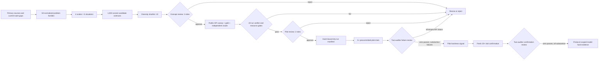

# ORBIT-Q problem-discovery research loop

This package contains the first source-grounded design matrix and a gated,
resumable workflow for future TensorCircuit benchmark problems. It expands 50
scientific families across four resource scales and five operational
situations, producing 1,000 deterministic candidate contracts. These are 1,000
auditable regimes, not 1,000 independently sourced problem statements. The
pipeline then selects ten candidates for human design review.

The shortlist is **not** a claim that GPT-5.6-sol cannot solve these problems.
All candidates have `empirical_status=untested`. A model-hardness claim is
allowed only after expert feasibility, human approval, repeated frozen-model
trials, and human failure classification.

## What was sampled

The research pass used five complementary search strategies:

1. landscape mapping across algorithms, control, metrology, QEC, simulation,
   open systems, measurement, chemistry, dynamics, and verification;
2. cross-vocabulary search for the same computational obstruction under
   different subfield names;
3. cross-method search around TensorCircuit representations, AD, channels,
   dynamic circuits, and tensor-network contraction;
4. negative-result search for infeasible scaling, barren plateaus,
   ill-conditioning, and weak statistical certificates;
5. benchmark/dataset search for task structures and documented agent gaps.

Each candidate is scored from eight perspectives: expected agent difficulty,
TensorCircuit path confidence, scientific value, verifier feasibility, runtime
fit, determinism, novelty, and shortcut resistance. These are transparent
design priors recorded in `candidates.jsonl`; they are never mixed with model
trial results.

`research_protocol.json` defines the repeatable next-cycle stages: query
planning, immutable raw-result ingest, claim-level normalization, exact and
semantic deduplication, coverage sampling, scoring, and human source review.
The current snapshot used agent-assisted primary-source research; this package
does not silently perform network searches. A search adapter must preserve its
query log and raw response hashes under `.artifacts/problem-discovery/` before
new source records can be curated into `catalog.json`.

## Human-gated workflow



The CLI requires distinct declared identities for the gate roles:

- `quantum_scientist`: physical meaning, conventions, and scientific value;
- `tensorcircuit_expert`: public pinned API and framework-native centrality;
- `verifier_engineer`: independent oracle, hidden tests, tolerances, and anti-cheat;
- `benchmark_owner`: protocol, resource envelope, and contamination controls;
- `independent_reviewer`: blind review of the frozen pilot package.

Prototype admission requires all of the following:

- public-API canary passes in the pinned image;
- expert baseline and independent oracle are separately hashed;
- verifier, prompt, image digest, and source commit are frozen;
- expert p95 runtime is at most 180 seconds;
- independent oracle runtime is at most 240 seconds;
- gold solution is at most 160 effective Python lines;
- verifier-only succeeds in at least 20 reproductions;
- measured peak memory fits the observed runner envelope.

Infrastructure, authentication, policy refusal, ambiguous specification, and
framework impossibility are excluded from model-hardness evidence. Runtime
alone is not a failure under the ORBIT-Q reward definition, although a missing
or excessive runtime blocks candidate admission here.

## Commands

Rebuild the deterministic corpus and report from the normalized catalog:

```bash
python3 scripts/run_problem_discovery.py build
python3 scripts/run_problem_discovery.py status
```

Record concept approval one role at a time:

```bash
python3 scripts/run_problem_discovery.py review \
  --candidate CANDIDATE_ID \
  --gate concept \
  --role quantum_scientist \
  --decision approve \
  --reviewer REVIEWER \
  --note "reason and evidence"
```

`record-prototype` accepts one JSON evidence bundle under
`.artifacts/problem-discovery/`. It recomputes artifact and log hashes, p95
runtime, peak memory, and reproduction counts rather than accepting summary
flags. The bundle must contain 20 verifier runs, three independent-oracle runs,
two accepted valid implementation styles, and six rejected verifier mutations.
After all three concept reviews and the prototype gate pass, two pilot reviews
are recorded with the same `review` command using `--gate pilot`.

Authorization is deliberately a dry action. It writes a manifest and never
launches Harbor or a model:

```bash
python3 scripts/run_problem_discovery.py authorize \
  --candidate CANDIDATE_ID \
  --protocol-config .artifacts/problem-discovery/protocol.json \
  --stage pilot \
  --seeds 101,102,103,104,105 \
  --output .artifacts/problem-discovery/run-manifest.json
```

The manifest binds the reviewed candidate hash to the model, prompt hash,
container digest, source commit, evaluator, baseline, oracle, and reviewer
decisions. The protocol config additionally freezes provider/model build,
reasoning effort, budgets, solver and Harbor versions, audit model, tool/network
policy, and hardware class. Outputs outside `.artifacts/problem-discovery/` or
overwrites of an existing manifest are rejected. Any reviewed content or gate
change revokes the authorization.

After an approved external Harbor run, `record-trial` imports a normalized
result JSON under `.artifacts/problem-discovery/`, verifies its raw Harbor-job
and solver-transcript hashes, derives scores and execution status from the
finished Harbor `result.json`, and checks its `orbit_q_attestation` against the
frozen manifest. A separately typed score cannot override the raw result. The
attestation binds the complete protocol configuration and names the responsible
runner operator. Local hashes provide tamper evidence, not third-party identity
proof; the two human auditors remain part of the trust boundary. The importer
does not infer why a run failed. A named reviewer must then use
`audit-trial` to classify that outcome. `hardness-status` counts only unique,
substantive failures on which two distinct failure auditors agree toward the
precommitted seed schedule; excluded, missing, extra, or disputed failures
invalidate the schedule. Any raw compound pass blocks a model-hard conclusion,
even before human audit. Five failures yield only a pilot signal. A fresh
confirmation manifest needs at least 20 valid trials before the stronger label.

```bash
python3 scripts/run_problem_discovery.py hardness-status \
  --candidate CANDIDATE_ID \
  --manifest-hash MANIFEST_HASH
```

Materialized prototypes are executed through the separate candidate-only
runner. It accepts exactly one explicit staged task, always requests one
Harbor trial, and is a dry run unless `--execute` is supplied. Verify the
packaged expert before invoking a solver:

```bash
python3 scripts/run_harbor_candidate.py \
  --task-dir .artifacts/problem-discovery/candidate-tasks/candidate-SLUG \
  --model gpt-5.6-sol \
  --audit-model gpt-5.6-sol \
  --expert-only \
  --force-auth-json \
  --bridge-loopback-proxy
```

For frozen repeated trials, `--candidate-seed INTEGER` is passed only to the
verifier as `ORBIT_Q_CANDIDATE_SEED`; it is never added to the solver
environment. Candidate evaluators must explicitly consume that variable, and
the precommitted seed schedule must be expert-prequalified before a real model
run. A seed that violates a numerical admission margin is rejected rather than
counted as model failure.

## Repository boundary

Discovery records stay under `reports/orbit_q_problem_discovery/`. Raw search
downloads, private holdouts, generated staging tasks, and model job logs belong
under gitignored `.artifacts/problem-discovery/` or a temporary directory.
Nothing in this workflow writes to `tasks/challenge-01` through
`tasks/challenge-12`; promotion into the active Harbor suite is a later,
explicit human decision.

## Artifacts

- `catalog.json`: normalized sources, sampling axes, 50 families, and design priors;
- `candidates.jsonl`: all 1,000 candidate contracts and screening decisions;
- `shortlist.json`: machine-readable ten-candidate review set;
- `shortlist.md`: human review report with scientific rationale and sources;
- `summary.json`: deterministic counts, score weights, and snapshot hash;
- `review_state.json`: empty-by-default human decisions and evidence ledger;
- `pipeline.py`: generation, validation, review gates, and manifest authorization;
- `research_protocol.json`: staged, resumable source-search and ingestion contract;
- `prototype_evidence.schema.json`: required file-backed prototype evidence;
- `trial_result.schema.json`: normalized, manifest-bound Harbor result format;
- `protocol_config.example.json`: frozen solver/verifier protocol template.

The next autoresearch cycle should append or replace normalized families only
after source/license review and near-duplicate analysis, then rebuild the
matrix. The first batch remains a reproducible snapshot rather than silently
changing under new search results.
