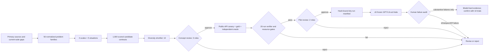

# ORBIT-Q problem autoresearch

This package contains the first source-grounded discovery batch for future
TensorCircuit benchmark problems. It expands 50 scientific families across
four resource scales and five operational situations, producing 1,000
deterministic candidate contracts. It then selects ten candidates for human
design review.

The shortlist is **not** a claim that GPT-5.6-sol cannot solve these problems.
All candidates have `empirical_status=untested`. A model-hardness claim is
allowed only after expert feasibility, human approval, repeated frozen-model
trials, and human failure classification.

## What was sampled

The research pass used five complementary search strategies:

1. landscape mapping across algorithms, control, metrology, QEC, simulation,
   open systems, measurement, chemistry, dynamics, and verification;
2. cross-vocabulary search for the same computational obstruction under
   different subfield names;
3. cross-method search around TensorCircuit representations, AD, channels,
   dynamic circuits, and tensor-network contraction;
4. negative-result search for infeasible scaling, barren plateaus,
   ill-conditioning, and weak statistical certificates;
5. benchmark/dataset search for task structures and documented agent gaps.

Each candidate is scored from eight perspectives: expected agent difficulty,
TensorCircuit path confidence, scientific value, verifier feasibility, runtime
fit, determinism, novelty, and shortcut resistance. These are transparent
design priors recorded in `candidates.jsonl`; they are never mixed with model
trial results.

## Human-gated workflow



The gate roles are deliberately separated:

- `quantum_scientist`: physical meaning, conventions, and scientific value;
- `tensorcircuit_expert`: public pinned API and framework-native centrality;
- `verifier_engineer`: independent oracle, hidden tests, tolerances, and anti-cheat;
- `benchmark_owner`: protocol, resource envelope, and contamination controls;
- `independent_reviewer`: blind review of the frozen pilot package.

Prototype admission requires all of the following:

- public-API canary passes in the pinned image;
- expert baseline and independent oracle are separately hashed;
- verifier, prompt, image digest, and source commit are frozen;
- expert p95 runtime is at most 180 seconds;
- independent oracle runtime is at most 240 seconds;
- gold solution is at most 160 effective Python lines;
- verifier-only succeeds in at least 20 reproductions;
- measured peak memory fits the observed runner envelope.

Infrastructure, authentication, policy refusal, ambiguous specification, and
framework impossibility are excluded from model-hardness evidence. Runtime
alone is not a failure under the ORBIT-Q reward definition, although a missing
or excessive runtime blocks candidate admission here.

## Commands

Rebuild the deterministic corpus and report from the normalized catalog:

```bash
python3 scripts/run_problem_discovery.py build
python3 scripts/run_problem_discovery.py status
```

Record concept approval one role at a time:

```bash
python3 scripts/run_problem_discovery.py review \
  --candidate CANDIDATE_ID \
  --gate concept \
  --role quantum_scientist \
  --decision approve \
  --reviewer REVIEWER \
  --note "reason and evidence"
```

`record-prototype` records the baseline/oracle hashes, pinned environment,
resource measurements, and reproducibility evidence. After all three concept
reviews and the prototype gate pass, two pilot reviews are recorded with the
same `review` command using `--gate pilot`.

Authorization is deliberately a dry action. It writes a manifest and never
launches Harbor or a model:

```bash
python3 scripts/run_problem_discovery.py authorize \
  --candidate CANDIDATE_ID \
  --model gpt-5.6-sol \
  --trials 5 \
  --output .artifacts/problem-discovery/run-manifest.json
```

The manifest binds the reviewed candidate hash to the model, prompt hash,
container digest, source commit, evaluator, baseline, oracle, and reviewer
decisions. Any candidate content change invalidates its prior approvals.

After an approved external Harbor run, `record-trial` imports only the raw
compound scores, runtime, execution status, seed, job ID, and result digest.
It does not infer why a run failed. A named reviewer must then use
`audit-trial` to classify that outcome. `hardness-status` counts only unique,
human-audited substantive failures toward the manifest's trial requirement;
excluded failures remain visible but do not count.

```bash
python3 scripts/run_problem_discovery.py hardness-status \
  --candidate CANDIDATE_ID \
  --manifest-hash MANIFEST_HASH
```

## Repository boundary

Discovery records stay under `reports/orbit_q_problem_discovery/`. Raw search
downloads, private holdouts, generated staging tasks, and model job logs belong
under gitignored `.artifacts/problem-discovery/` or a temporary directory.
Nothing in this workflow writes to `tasks/challenge-01` through
`tasks/challenge-12`; promotion into the active Harbor suite is a later,
explicit human decision.

## Artifacts

- `catalog.json`: normalized sources, sampling axes, 50 families, and design priors;
- `candidates.jsonl`: all 1,000 candidate contracts and screening decisions;
- `shortlist.json`: machine-readable ten-candidate review set;
- `shortlist.md`: human review report with scientific rationale and sources;
- `summary.json`: deterministic counts, score weights, and snapshot hash;
- `review_state.json`: empty-by-default human decisions and evidence ledger;
- `pipeline.py`: generation, validation, review gates, and manifest authorization.

The next autoresearch cycle should append or replace normalized families only
after source/license review and near-duplicate analysis, then rebuild the
matrix. The first batch remains a reproducible snapshot rather than silently
changing under new search results.
